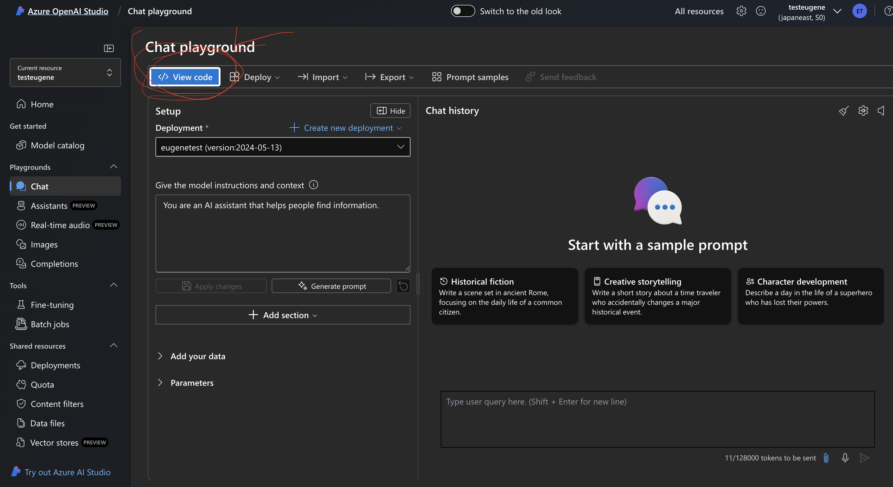
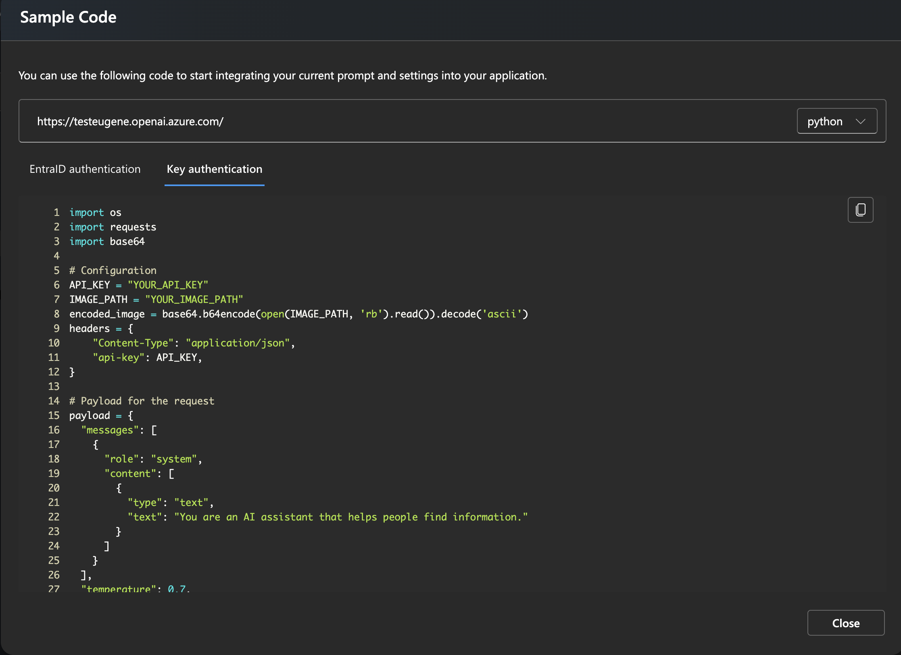
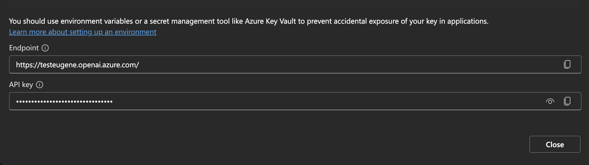

# Setup 

1. create a virtual env for python:
  - `python3 -m venv myenv`

2. run the requirements.txt install
  - `pip3 install -r requirements.txt`

3. create a `.env` file with the following contents

  ```bash
  API_KEY = "<your_azure_openai_key>"
  ```

  -  retrieve this key from your Azure OpenAI studio when deploying a model
  
  

  

  

  - copy the key and paste it in the .env file as an env var

4. run the `main.py` script in this github
